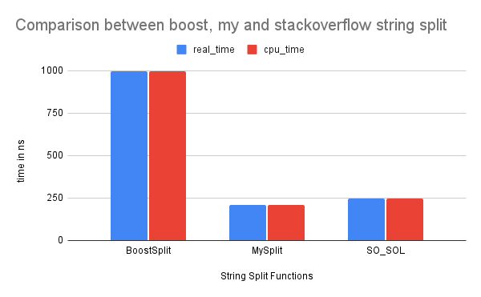

# String Split implementation in C++

### Source Code

```c++
    auto split(std::vector<std::string> &result, std::string_view s, std::string_view t) -> std::vector<std::string> &
    {

        if (t.empty())
        {
            result.emplace_back(s);
            return result;
        }

        result.reserve(s.size());

        if (!s.empty())
        {
            std::size_t first = 0;
            while (first < s.size())
            {
                const auto foundIndex = s.find(t, first);
                const auto last = foundIndex < s.size() ? foundIndex : s.size();
                result.emplace_back(s.begin() + first, s.begin() + last);
                first = last + t.size();
            }
        }
        return result;
    }
```

benchmark results between

> - Boost string split
> - Stackoverflow solution for split
> - Split function that I wrote


